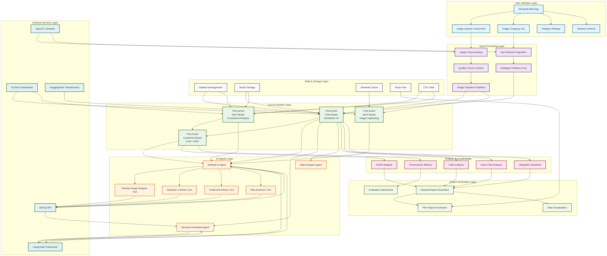

# NutriScanAI - Diagram Image Generation

This guide explains how to generate separate PNG images for each architecture diagram in the NutriScanAI project.

## 📋 Prerequisites

You have several options for generating the diagram images:

### Option 1: mermaid-cli (Recommended)
```bash
# Install mermaid-cli globally
npm install -g @mermaid-js/mermaid-cli

# Verify installation
mmdc --version
```

### Option 2: Python with requests
```bash
# Install requests library
pip install requests
```

### Option 3: Puppeteer (Advanced)
```bash
# Install Node.js and Puppeteer
npm install -g puppeteer
```

## 🚀 Generating Images

### Method 1: Using the main script
```bash
# Run the main generation script
python generate_diagram_images.py
```

### Method 2: Using the alternative script
```bash
# Run the alternative script (tries multiple methods)
python generate_diagrams_alternative.py
```

## 📁 Output

The scripts will create a `diagram_images/` folder containing:

- **10 PNG files** - One for each architecture diagram
- **index.html** - A beautiful web page showing all images
- **README.md** - A simple markdown file with all images

## 📊 Generated Diagrams

1. **01_main_system_architecture.png** - Complete system overview
2. **02_detailed_agent_connections_and_parameters.png** - AI agents and tools
3. **03_data_flow_and_processing_pipeline.png** - Processing sequence
4. **04_model_architecture_details.png** - CNN, MLP, BLIP structures
5. **05_file_dependencies_and_imports.png** - Code dependencies
6. **06_configuration_parameters.png** - System configurations
7. **07_dataset_structure_and_classes.png** - Data organization
8. **08_error_handling_and_fallback_mechanisms.png** - Error handling
9. **09_performance_monitoring_and_metrics.png** - Performance tracking
10. **10_security_and_privacy_considerations.png** - Security measures

## 🎨 Image Specifications

- **Format**: PNG with transparent background
- **Resolution**: 1920x1080 (high quality)
- **Color Scheme**: Professional medical/tech theme
- **File Size**: Optimized for web and documentation

## 🔧 Troubleshooting

### Common Issues:

1. **mermaid-cli not found**
   ```bash
   npm install -g @mermaid-js/mermaid-cli
   ```

2. **Python requests error**
   ```bash
   pip install requests
   ```

3. **Permission errors**
   ```bash
   # On macOS/Linux, you might need:
   sudo npm install -g @mermaid-js/mermaid-cli
   ```

4. **Node.js not installed**
   ```bash
   # Install Node.js from: https://nodejs.org/
   ```

### Manual Generation:

If the scripts don't work, you can manually generate images:

1. **Copy Mermaid code** from `preview_diagrams.html`
2. **Visit**: https://mermaid.live/
3. **Paste the code** and export as PNG
4. **Repeat** for each diagram

## 📝 Usage Examples

### For Documentation:
```markdown

```

### For Presentations:
- Use the high-resolution PNG files
- All images have transparent backgrounds
- Professional color scheme suitable for presentations

### For Web:
- Images are optimized for web use
- Include the `index.html` file for easy viewing
- All images are responsive and mobile-friendly

## 🎯 Next Steps

After generating the images:

1. **Review** all generated images for quality
2. **Use** in your documentation, presentations, or reports
3. **Share** the `diagram_images/` folder with your team
4. **Update** any existing documentation with the new images

## 📞 Support

If you encounter issues:

1. Check the troubleshooting section above
2. Verify all prerequisites are installed
3. Try the alternative script if the main one fails
4. Use the manual generation method as a fallback

---

**Happy diagram generation! 🎉** 