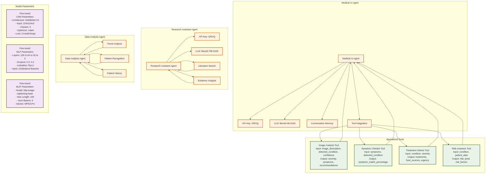
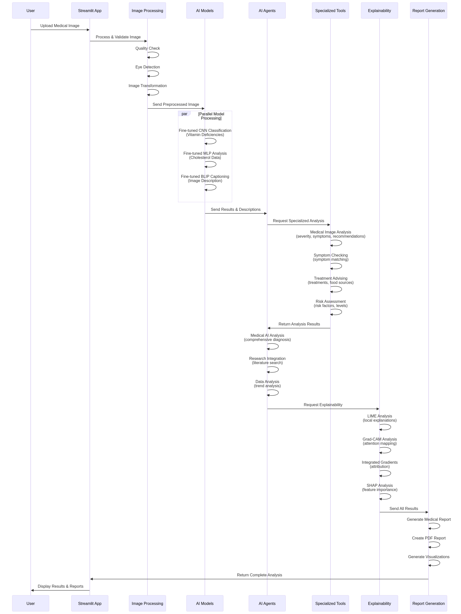
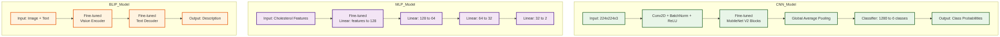
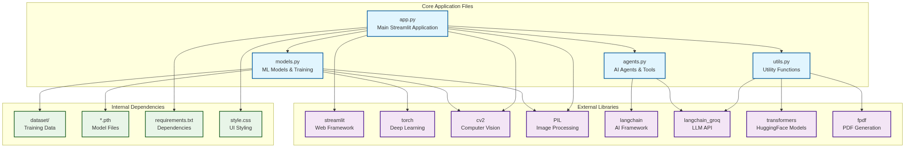
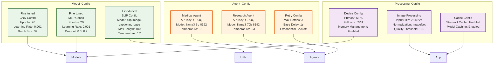
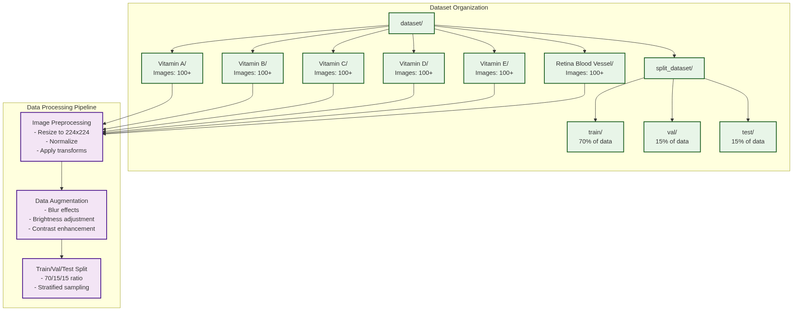
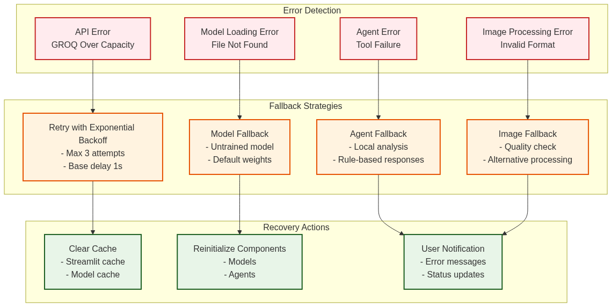
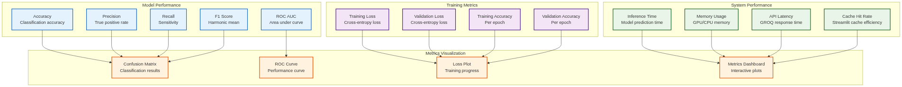
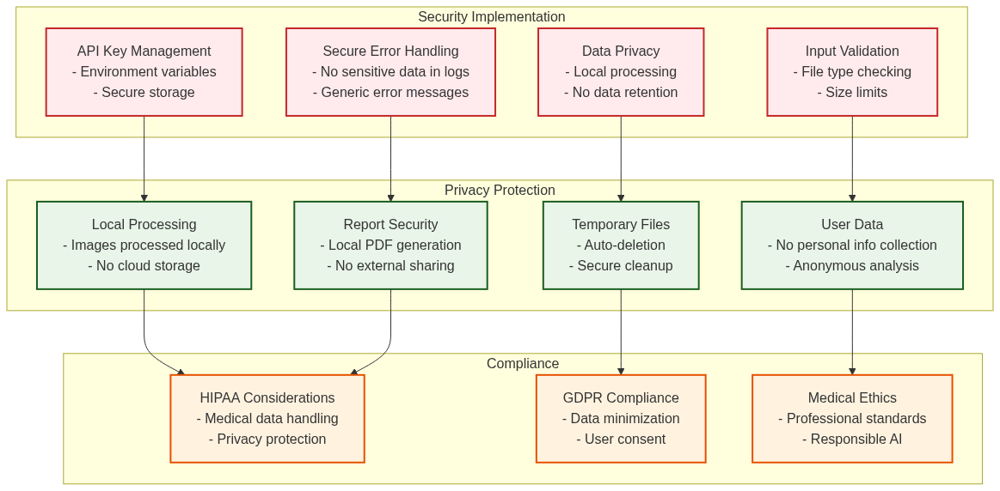

# NutriScanAI Architecture Diagram Images

Generated PNG images for each architecture diagram:

## 1. Main System Architecture

## 2. Detailed Agent Connections and Parameters

## 3. Data Flow and Processing Pipeline

## 4. Model Architecture Details

## 5. File Dependencies and Imports

## 6. Configuration Parameters

## 7. Dataset Structure and Classes

## 8. Error Handling and Fallback Mechanisms

## 9. Performance Monitoring and Metrics

## 10. Security and Privacy Considerations

