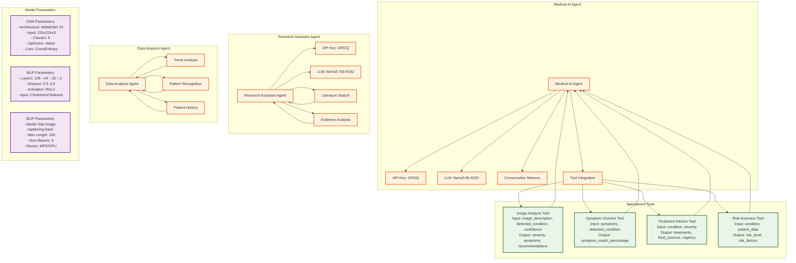
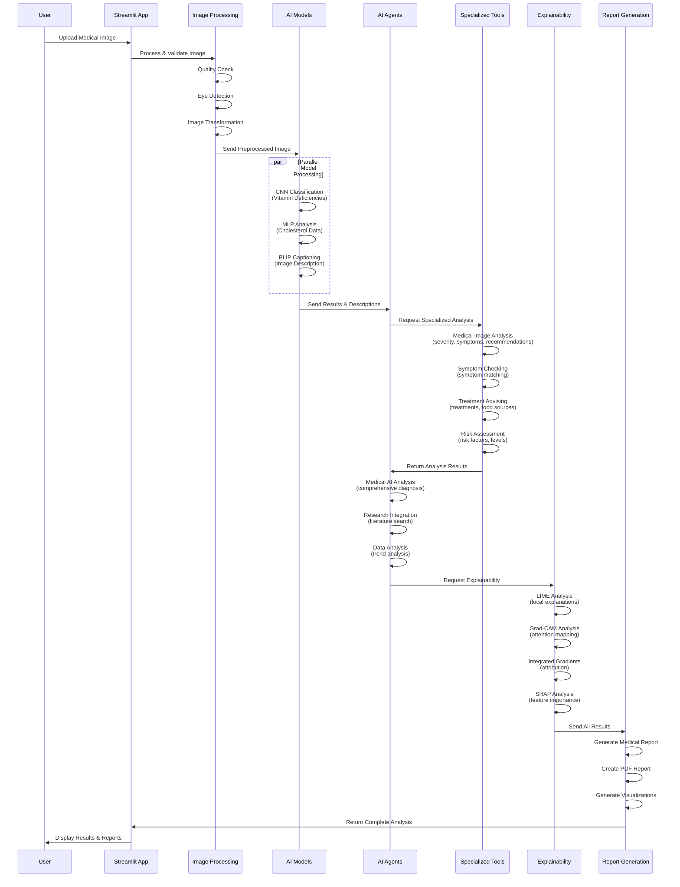
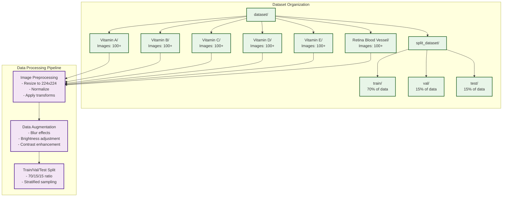
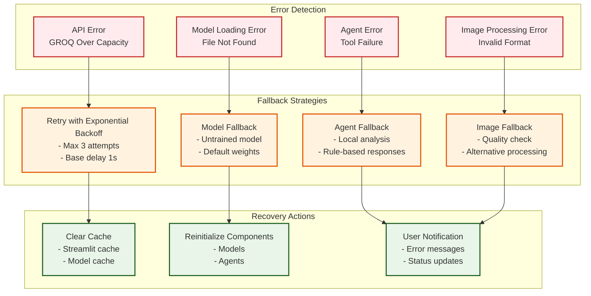
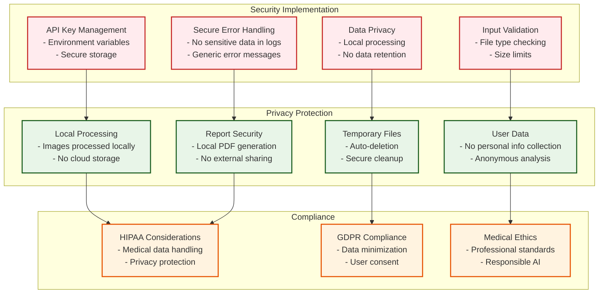

# NutriScanAI - Complete System Architecture Diagrams

## Overview
This document contains comprehensive Mermaid diagrams showing the complete architecture, connections, and workflow of the NutriScanAI project - an AI-powered medical image analysis platform for detecting vitamin deficiencies and retinal conditions.

---

## 1. Main System Architecture

```mermaid
graph TB
    %% User Interface Components
    subgraph "User Interface Layer"
        UI[Streamlit Web App]
        Upload[Image Upload Component]
        Crop[Image Cropping Tool]
        Settings[Analysis Settings]
        Sidebar[Sidebar Controls]
    end

    %% Input Processing Components
    subgraph "Input Processing Layer"
        Preprocess[Image Preprocessing]
        Quality[Quality Check Function]
        EyeDetect[Eye Detection Algorithm]
        CropFallback[Intelligent Fallback Crop]
        Transform[Image Transform Pipeline]
    end

    %% Core AI Models
    subgraph "Core AI Models Layer"
        CNN[CNN Model<br/>MobileNet V2]
        MLP[MLP Model<br/>Cholesterol Analysis]
        BLIP[BLIP Model<br/>Image Captioning]
        Combined[Combined Model<br/>CNN + MLP]
    end

    %% AI Agents and Tools
    subgraph "AI Agents Layer"
        MedicalAgent[Medical AI Agent]
        ResearchAgent[Research Assistant Agent]
        DataAgent[Data Analysis Agent]
        
        %% Tools
        ImageTool[Medical Image Analysis Tool]
        SymptomTool[Symptom Checker Tool]
        TreatmentTool[Treatment Advisor Tool]
        RiskTool[Risk Assessor Tool]
    end

    %% Analysis and Explainability
    subgraph "Analysis & Explainability Layer"
        LIME[LIME Analysis]
        GradCAM[Grad-CAM Analysis]
        IG[Integrated Gradients]
        SHAP[SHAP Analysis]
        Metrics[Performance Metrics]
    end

    %% Output Generation
    subgraph "Output Generation Layer"
        Report[Medical Report Generator]
        PDF[PDF Report Generator]
        Dashboard[Evaluation Dashboard]
        Visualization[Data Visualization]
    end

    %% Data and Storage
    subgraph "Data & Storage Layer"
        Dataset[Dataset Management]
        Models[Model Storage]
        Cache[Streamlit Cache]
        Temp[Temp Files]
        CSV[CSV Data]
    end

    %% External Services
    subgraph "External Services Layer"
        GROQ[GROQ API]
        LangChain[LangChain Framework]
        OpenCV[OpenCV Libraries]
        Torch[PyTorch Framework]
        Transformers[HuggingFace Transformers]
    end

    %% Connections - User Interface to Processing
    UI --> Upload
    UI --> Crop
    UI --> Settings
    UI --> Sidebar
    Upload --> Preprocess
    Crop --> EyeDetect
    EyeDetect --> CropFallback
    Preprocess --> Quality
    Quality --> Transform

    %% Connections - Processing to Models
    Transform --> CNN
    Transform --> BLIP
    CropFallback --> CNN
    CSV --> MLP
    CNN --> Combined
    MLP --> Combined

    %% Connections - Models to Agents
    CNN --> MedicalAgent
    BLIP --> MedicalAgent
    MLP --> MedicalAgent
    Combined --> MedicalAgent
    
    CNN --> ResearchAgent
    CNN --> DataAgent

    %% Connections - Agents to Tools
    MedicalAgent --> ImageTool
    MedicalAgent --> SymptomTool
    MedicalAgent --> TreatmentTool
    MedicalAgent --> RiskTool

    %% Connections - Tools to External Services
    ImageTool --> GROQ
    SymptomTool --> GROQ
    TreatmentTool --> GROQ
    RiskTool --> GROQ
    MedicalAgent --> LangChain
    ResearchAgent --> LangChain

    %% Connections - Models to Analysis
    CNN --> LIME
    CNN --> GradCAM
    CNN --> IG
    Combined --> SHAP
    Combined --> Metrics

    %% Connections - Analysis to Output
    LIME --> Report
    GradCAM --> Report
    IG --> Report
    SHAP --> Report
    Metrics --> Dashboard
    Report --> PDF
    Report --> Visualization

    %% Connections - Data Flow
    Dataset --> CNN
    Dataset --> MLP
    Models --> CNN
    Models --> MLP
    Cache --> BLIP
    Temp --> PDF
    CSV --> MLP

    %% Connections - External Services
    GROQ --> MedicalAgent
    GROQ --> ResearchAgent
    LangChain --> MedicalAgent
    LangChain --> ResearchAgent
    OpenCV --> EyeDetect
    OpenCV --> Preprocess
    Torch --> CNN
    Torch --> MLP
    Transformers --> BLIP

    %% Styling
    classDef uiLayer fill:#e1f5fe,stroke:#01579b,stroke-width:2px
    classDef processingLayer fill:#f3e5f5,stroke:#4a148c,stroke-width:2px
    classDef modelLayer fill:#e8f5e8,stroke:#1b5e20,stroke-width:2px
    classDef agentLayer fill:#fff3e0,stroke:#e65100,stroke-width:2px
    classDef analysisLayer fill:#fce4ec,stroke:#880e4f,stroke-width:2px
    classDef outputLayer fill:#f1f8e9,stroke:#33691e,stroke-width:2px
    classDef dataLayer fill:#fafafa,stroke:#424242,stroke-width:2px
    classDef externalLayer fill:#e0f2f1,stroke:#004d40,stroke-width:2px

    class UI,Upload,Crop,Settings,Sidebar uiLayer
    class Preprocess,Quality,EyeDetect,CropFallback,Transform processingLayer
    class CNN,MLP,BLIP,Combined modelLayer
    class MedicalAgent,ResearchAgent,DataAgent,ImageTool,SymptomTool,TreatmentTool,RiskTool agentLayer
    class LIME,GradCAM,IG,SHAP,Metrics analysisLayer
    class Report,PDF,Dashboard,Visualization outputLayer
    class Dataset,Models,Cache,Temp,CSV dataLayer
    class GROQ,LangChain,OpenCV,Torch,Transformers externalLayer
```



---

## 2. Detailed Agent Connections and Parameters



---

## 3. Data Flow and Processing Pipeline



---

## 4. Model Architecture Details

```mermaid
graph TB
    %% CNN Architecture
    subgraph "CNN Model (MobileNet V2)"
        CNN_Input[Input: 224x224x3]
        CNN_Conv[Conv2D + BatchNorm + ReLU]
        CNN_MobileNet[MobileNet V2 Blocks<br/>- Depthwise Separable Convolutions<br/>- Inverted Residuals<br/>- Linear Bottlenecks]
        CNN_Pool[Global Average Pooling]
        CNN_Classifier[Classifier<br/>- Linear: 1280 → 6 classes<br/>- Softmax Activation]
        CNN_Output[Output: Class Probabilities]
    end

    %% MLP Architecture
    subgraph "MLP Model (Cholesterol Analysis)"
        MLP_Input[Input: Cholesterol Features]
        MLP_Layer1[Linear: features → 128<br/>ReLU + Dropout(0.3)]
        MLP_Layer2[Linear: 128 → 64<br/>ReLU + Dropout(0.2)]
        MLP_Layer3[Linear: 64 → 32<br/>ReLU]
        MLP_Output[Linear: 32 → 2<br/>Binary Classification]
    end

    %% BLIP Architecture
    subgraph "BLIP Model (Image Captioning)"
        BLIP_Input[Input: Image + Optional Text]
        BLIP_Encoder[Vision Encoder<br/>- ViT Architecture<br/>- Image Patches]
        BLIP_Decoder[Text Decoder<br/>- Transformer Architecture<br/>- Beam Search]
        BLIP_Output[Output: Image Description]
    end

    %% Connections
    CNN_Input --> CNN_Conv
    CNN_Conv --> CNN_MobileNet
    CNN_MobileNet --> CNN_Pool
    CNN_Pool --> CNN_Classifier
    CNN_Classifier --> CNN_Output

    MLP_Input --> MLP_Layer1
    MLP_Layer1 --> MLP_Layer2
    MLP_Layer2 --> MLP_Layer3
    MLP_Layer3 --> MLP_Output

    BLIP_Input --> BLIP_Encoder
    BLIP_Encoder --> BLIP_Decoder
    BLIP_Decoder --> BLIP_Output

    %% Styling
    classDef cnnArch fill:#e8f5e8,stroke:#1b5e20,stroke-width:2px
    classDef mlpArch fill:#f3e5f5,stroke:#4a148c,stroke-width:2px
    classDef blipArch fill:#fff3e0,stroke:#e65100,stroke-width:2px

    class CNN_Input,CNN_Conv,CNN_MobileNet,CNN_Pool,CNN_Classifier,CNN_Output cnnArch
    class MLP_Input,MLP_Layer1,MLP_Layer2,MLP_Layer3,MLP_Output mlpArch
    class BLIP_Input,BLIP_Encoder,BLIP_Decoder,BLIP_Output blipArch
```

---

## 5. File Dependencies and Imports

```mermaid
graph TB
    %% Main Application Files
    subgraph "Core Application Files"
        App[app.py<br/>Main Streamlit Application]
        Agents[agents.py<br/>AI Agents & Tools]
        Models[models.py<br/>ML Models & Training]
        Utils[utils.py<br/>Utility Functions]
    end

    %% External Dependencies
    subgraph "External Libraries"
        Streamlit[streamlit<br/>Web Framework]
        Torch[torch<br/>Deep Learning]
        OpenCV[cv2<br/>Computer Vision]
        PIL[PIL<br/>Image Processing]
        LangChain[langchain<br/>AI Framework]
        GROQ[langchain_groq<br/>LLM API]
        Transformers[transformers<br/>HuggingFace Models]
        FPDF[fpdf<br/>PDF Generation]
    end

    %% Internal Dependencies
    subgraph "Internal Dependencies"
        Dataset[dataset/<br/>Training Data]
        ModelWeights[*.pth<br/>Model Files]
        Config[requirements.txt<br/>Dependencies]
        Styles[style.css<br/>UI Styling]
    end

    %% Import Relationships
    App --> Agents
    App --> Models
    App --> Utils
    
    Agents --> LangChain
    Agents --> GROQ
    
    Models --> Torch
    Models --> OpenCV
    Models --> PIL
    
    Utils --> Transformers
    Utils --> FPDF
    Utils --> GROQ
    
    App --> Streamlit
    App --> OpenCV
    App --> PIL
    
    Models --> Dataset
    Models --> ModelWeights
    
    App --> Config
    App --> Styles

    %% Styling
    classDef coreFile fill:#e1f5fe,stroke:#01579b,stroke-width:2px
    classDef externalLib fill:#f3e5f5,stroke:#4a148c,stroke-width:2px
    classDef internalDep fill:#e8f5e8,stroke:#1b5e20,stroke-width:2px

    class App,Agents,Models,Utils coreFile
    class Streamlit,Torch,OpenCV,PIL,LangChain,GROQ,Transformers,FPDF externalLib
    class Dataset,ModelWeights,Config,Styles internalDep
```



---

## 6. Configuration Parameters

```mermaid
graph TB
    %% Model Configuration
    subgraph "Model Configuration"
        CNN_Config[CNN Configuration<br/>- Epochs: 20<br/>- Patience: 7<br/>- Learning Rate: 0.001<br/>- Batch Size: 32<br/>- Accumulation Steps: 4]
        
        MLP_Config[MLP Configuration<br/>- Epochs: 20<br/>- Patience: 7<br/>- Learning Rate: 0.001<br/>- Batch Size: 64<br/>- Dropout: 0.3, 0.2]
        
        BLIP_Config[BLIP Configuration<br/>- Model: blip-image-captioning-base<br/>- Max Length: 100<br/>- Num Beams: 5<br/>- Temperature: 0.7]
    end

    %% Agent Configuration
    subgraph "Agent Configuration"
        Medical_Config[Medical Agent Config<br/>- API Key: GROQ<br/>- Model: llama3-8b-8192<br/>- Temperature: 0.1<br/>- Max Tokens: 1000]
        
        Research_Config[Research Agent Config<br/>- API Key: GROQ<br/>- Model: llama3-70b-8192<br/>- Temperature: 0.3<br/>- Max Tokens: 2000]
        
        Retry_Config[Retry Configuration<br/>- Max Retries: 3<br/>- Base Delay: 1s<br/>- Exponential Backoff]
    end

    %% Processing Configuration
    subgraph "Processing Configuration"
        Image_Config[Image Processing Config<br/>- Input Size: 224x224<br/>- Normalization: ImageNet<br/>- Augmentation: Blur, Brightness<br/>- Quality Threshold: 100]
        
        Cache_Config[Cache Configuration<br/>- Streamlit Cache: Enabled<br/>- Model Caching: Enabled<br/>- TTL: Default]
        
        Device_Config[Device Configuration<br/>- Primary: MPS (Apple Silicon)<br/>- Fallback: CPU<br/>- Memory Management: Enabled]
    end

    %% Connections
    CNN_Config --> Models
    MLP_Config --> Models
    BLIP_Config --> Utils
    
    Medical_Config --> Agents
    Research_Config --> Agents
    Retry_Config --> Agents
    
    Image_Config --> App
    Cache_Config --> App
    Device_Config --> Models

    %% Styling
    classDef modelConfig fill:#e8f5e8,stroke:#1b5e20,stroke-width:2px
    classDef agentConfig fill:#fff3e0,stroke:#e65100,stroke-width:2px
    classDef processConfig fill:#f3e5f5,stroke:#4a148c,stroke-width:2px

    class CNN_Config,MLP_Config,BLIP_Config modelConfig
    class Medical_Config,Research_Config,Retry_Config agentConfig
    class Image_Config,Cache_Config,Device_Config processConfig
```

---

## 7. Dataset Structure and Classes



---

## 8. Error Handling and Fallback Mechanisms



---

## 9. Performance Monitoring and Metrics

```mermaid
graph TB
    %% Performance Metrics
    subgraph "Model Performance"
        Accuracy[Accuracy<br/>Classification accuracy]
        Precision[Precision<br/>True positive rate]
        Recall[Recall<br/>Sensitivity]
        F1_Score[F1 Score<br/>Harmonic mean]
        ROC_AUC[ROC AUC<br/>Area under curve]
    end

    %% Training Metrics
    subgraph "Training Metrics"
        Train_Loss[Training Loss<br/>Cross-entropy loss]
        Val_Loss[Validation Loss<br/>Cross-entropy loss]
        Train_Acc[Training Accuracy<br/>Per epoch]
        Val_Acc[Validation Accuracy<br/>Per epoch]
    end

    %% System Performance
    subgraph "System Performance"
        Inference_Time[Inference Time<br/>Model prediction time]
        Memory_Usage[Memory Usage<br/>GPU/CPU memory]
        API_Latency[API Latency<br/>GROQ response time]
        Cache_Hit[Cache Hit Rate<br/>Streamlit cache efficiency]
    end

    %% Visualization
    subgraph "Metrics Visualization"
        Confusion_Matrix[Confusion Matrix<br/>Classification results]
        ROC_Curve[ROC Curve<br/>Performance curve]
        Loss_Plot[Loss Plot<br/>Training progress]
        Metrics_Dashboard[Metrics Dashboard<br/>Interactive plots]
    end

    %% Connections
    Accuracy --> Confusion_Matrix
    Precision --> Confusion_Matrix
    Recall --> Confusion_Matrix
    F1_Score --> Confusion_Matrix
    ROC_AUC --> ROC_Curve
    
    Train_Loss --> Loss_Plot
    Val_Loss --> Loss_Plot
    Train_Acc --> Loss_Plot
    Val_Acc --> Loss_Plot
    
    Inference_Time --> Metrics_Dashboard
    Memory_Usage --> Metrics_Dashboard
    API_Latency --> Metrics_Dashboard
    Cache_Hit --> Metrics_Dashboard

    %% Styling
    classDef metrics fill:#e3f2fd,stroke:#1565c0,stroke-width:2px
    classDef training fill:#f3e5f5,stroke:#4a148c,stroke-width:2px
    classDef system fill:#e8f5e8,stroke:#1b5e20,stroke-width:2px
    classDef viz fill:#fff3e0,stroke:#e65100,stroke-width:2px

    class Accuracy,Precision,Recall,F1_Score,ROC_AUC metrics
    class Train_Loss,Val_Loss,Train_Acc,Val_Acc training
    class Inference_Time,Memory_Usage,API_Latency,Cache_Hit system
    class Confusion_Matrix,ROC_Curve,Loss_Plot,Metrics_Dashboard viz
```



---

## 10. Security and Privacy Considerations



---

## Summary

This comprehensive diagram collection provides a complete visual representation of the NutriScanAI system architecture, including:

1. **Main System Architecture** - Complete component overview
2. **Agent Connections** - Detailed AI agent interactions and parameters
3. **Data Flow Pipeline** - Step-by-step processing sequence
4. **Model Architectures** - CNN, MLP, and BLIP model structures
5. **File Dependencies** - Import relationships and external libraries
6. **Configuration Parameters** - All system configurations
7. **Dataset Structure** - Data organization and processing
8. **Error Handling** - Fallback mechanisms and recovery
9. **Performance Monitoring** - Metrics and evaluation
10. **Security & Privacy** - Protection measures and compliance

Each diagram is color-coded and shows the specific connections, parameters, and data flow between all components of the NutriScanAI medical image analysis platform. 