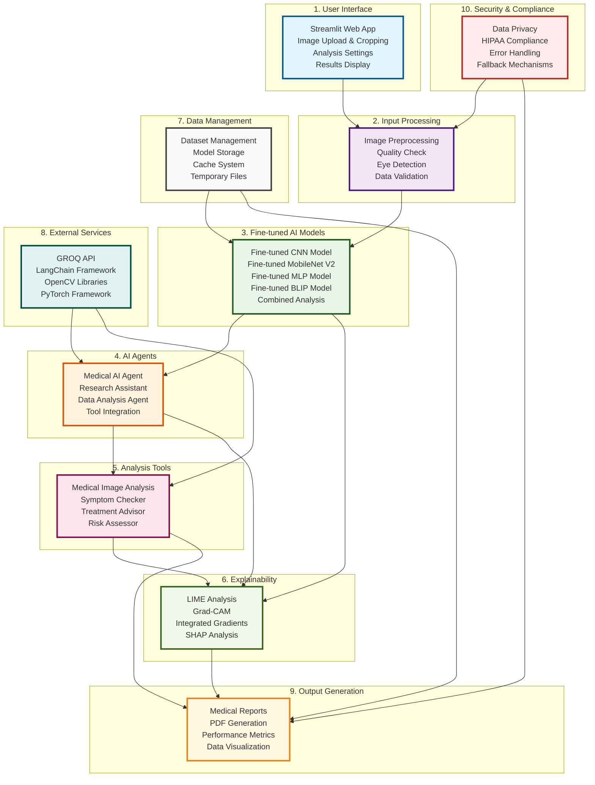

# NutriScanAI - Complete Architecture Block Diagram

## High-Level System Architecture (10 Main Blocks)

## Block Descriptions

### 1. User Interface
- **Streamlit Web App**: Main application interface
- **Image Upload & Cropping**: Interactive image handling
- **Analysis Settings**: User configuration options
- **Results Display**: Comprehensive results presentation

### 2. Input Processing
- **Image Preprocessing**: Quality enhancement and normalization
- **Quality Check**: Validation of image suitability
- **Eye Detection**: Automated eye region identification
- **Data Validation**: Input verification and error handling

### 3. Fine-tuned AI Models
- **Fine-tuned CNN Model**: MobileNet V2 for vitamin deficiency classification
- **Fine-tuned MLP Model**: Cholesterol analysis and numerical processing
- **Fine-tuned BLIP Model**: Image captioning and description generation
- **Combined Analysis**: Integrated model predictions

### 4. AI Agents
- **Medical AI Agent**: Primary medical analysis and diagnosis
- **Research Assistant**: Literature search and evidence integration
- **Data Analysis Agent**: Trend analysis and pattern recognition
- **Tool Integration**: Coordination of specialized tools

### 5. Analysis Tools
- **Medical Image Analysis**: Condition severity assessment
- **Symptom Checker**: Symptom correlation analysis
- **Treatment Advisor**: Evidence-based recommendations
- **Risk Assessor**: Health risk evaluation

### 6. Explainability
- **LIME Analysis**: Local interpretable model explanations
- **Grad-CAM**: Gradient-weighted class activation mapping
- **Integrated Gradients**: Attribution analysis
- **SHAP Analysis**: SHapley Additive exPlanations

### 7. Data Management
- **Dataset Management**: Training/validation/test data organization
- **Model Storage**: Pre-trained model weights and configurations
- **Cache System**: Performance optimization and caching
- **Temporary Files**: Processing file management

### 8. External Services
- **GROQ API**: Large language model services
- **LangChain Framework**: Agent orchestration and tool management
- **OpenCV Libraries**: Computer vision operations
- **PyTorch Framework**: Deep learning computations

### 9. Output Generation
- **Medical Reports**: Comprehensive analysis documentation
- **PDF Generation**: Professional report creation
- **Performance Metrics**: Model evaluation and statistics
- **Data Visualization**: Interactive charts and graphs

### 10. Security & Compliance
- **Data Privacy**: Local processing and privacy protection
- **HIPAA Compliance**: Medical data handling standards
- **Error Handling**: Robust error management and recovery
- **Fallback Mechanisms**: Alternative processing paths

## System Flow

1. **User Interface** receives medical images and user inputs
2. **Input Processing** validates and prepares the data
3. **Fine-tuned AI Models** perform initial analysis and classification
4. **AI Agents** coordinate comprehensive medical analysis
5. **Analysis Tools** provide specialized medical insights
6. **Explainability** ensures transparency in AI decisions
7. **Data Management** supports all processing operations
8. **External Services** provide additional AI capabilities
9. **Output Generation** creates professional medical reports
10. **Security & Compliance** ensures data protection throughout

## Key Features

- **10 Main Blocks**: Simplified architecture overview
- **Clear Data Flow**: Logical progression from input to output
- **Comprehensive Coverage**: All major system components included
- **Professional Design**: Clean, medical-themed color scheme
- **Scalable Structure**: Modular design for easy extension 